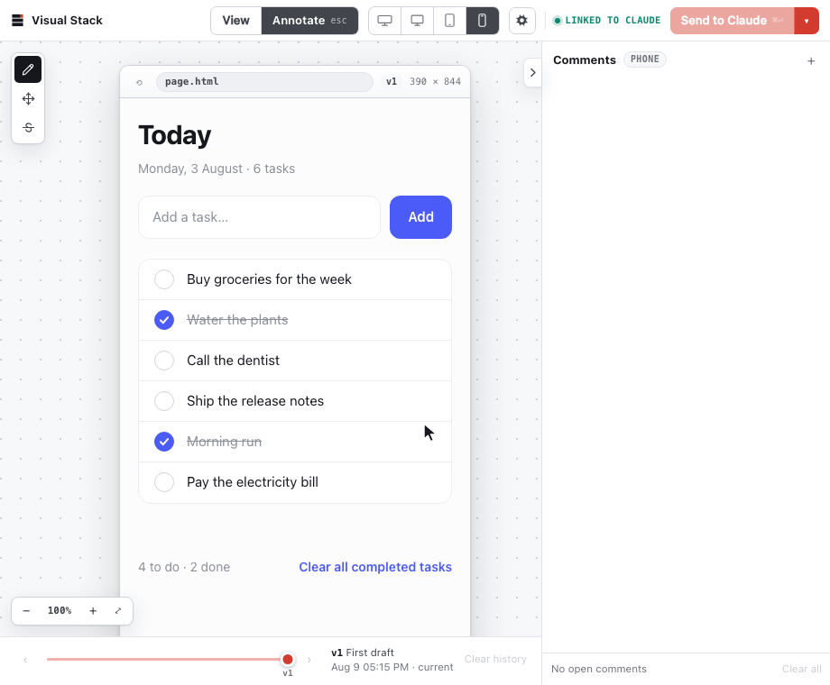

# Visual Stack

[](https://github.com/Cavalry-Collective/visual-stack/actions/workflows/ci.yml)
[](https://github.com/Cavalry-Collective/visual-stack/actions/workflows/security.yml)
[](https://scorecard.dev/viewer/?uri=github.com/Cavalry-Collective/visual-stack)
[](LICENSE)

<!-- Hidden until each one reports green again.
     Sonar has not analysed the repository since v5.0.0: the quality gate is
     not computed and the security rating is still the E it was left on.

[](https://sonarcloud.io/summary/new_code?id=Cavalry-Collective_visual-stack)
[](https://sonarcloud.io/summary/new_code?id=Cavalry-Collective_visual-stack)
-->


## Stop prompting. Start pointing.

Visual Stack adds a Figma-like feedback layer to AI coding agents.

Create a new screen, or open an existing app. Click anywhere and leave highly professional feedback such as:

> "claude its 3am just align the buttons"
>
> "why is everything a card. who hurt you"
>
> "pls undo the series b dashboard energy we have 4 users"
>
> "the padding is now between you and god"

Your agent applies the feedback and updates the design in the same place, hopefully without adding another gradient.


*Point. Comment. Iterate. No more jumping between chat and the UI.*

## Get started

### Claude Code

Install, in Claude Code:

```text
/plugin marketplace add Cavalry-Collective/visual-stack
/plugin install vstack@cavalry-collective
```

Then run:

```text
/vstack:review Wireframe a desktop personal task manager with minimal aesthetics.
```

### Codex

Install, in your terminal:

```text
codex plugin marketplace add Cavalry-Collective/visual-stack
codex plugin add vstack@cavalry-collective
```

Then run:

```text
$vstack:review Wireframe a desktop personal task manager with minimal aesthetics.
```

## What you can do

- Work in a familiar, Figma-like interface.
- Click any element and leave feedback exactly where the problem is hiding.
- Drag a thing to where it belongs, or strike out what should go — no note required.
- Stay in the workspace as your agent publishes each update.
- Preview desktop, tablet, and mobile layouts before production does it for you.
- Compare revisions and identify the exact moment things went wrong.
- Replace “you know what I mean” with actual context.

## Why Visual Stack?

Design feedback is spatial. Chat is linear. Humans are tired.

As feedback becomes more visual, chat becomes the bottleneck. Context gets buried in long conversations. Screenshots go stale. Describing which element you mean becomes a small detective novel.

Visual Stack keeps every comment attached to the element, route, and version it refers to. Your agent receives the feedback with the visual context intact.

No scrolling back through the chat. No screenshot graveyard on your desktop. No describing what you could just point at.

## Requirements

- A current version of Claude Code or Codex
- A supported Node.js LTS release
- Git
- A local web browser
- At least one strong opinion about border radius

## Technical Details

### Live Link

Each workspace is linked to one agent session. The link holds while that session is active and its heartbeat is less than 15 seconds old. Comments wait in one FIFO, and only the active comment is in the agent's hands.


### Review Lifecycle


## Security

Installing this plugin runs its code on your machine, so every change to `main` passes a set of scans before it lands: static analysis, a secret scan over the whole history, a workflow audit, and a code-quality gate. The badges above report the last run. [SECURITY.md](SECURITY.md) says what each gate enforces and how to report a vulnerability.

## Contribute

Visual Stack is open source and under active development. Expect rough edges, breaking changes, and occasional moments of character development.

Feedback and contributions are welcome.

- [Report an idea or bug](https://github.com/Cavalry-Collective/visual-stack/issues)
- [Read the contribution guide](CONTRIBUTING.md)
- [Report a security issue](SECURITY.md)

---

Built by [DeyangChan](https://github.com/DeyangChan), presumably after one too many rounds of screenshot-based feedback. Released by [Cavalry Collective](https://cavalry.sg).

Licensed under the [MIT License](LICENSE).
